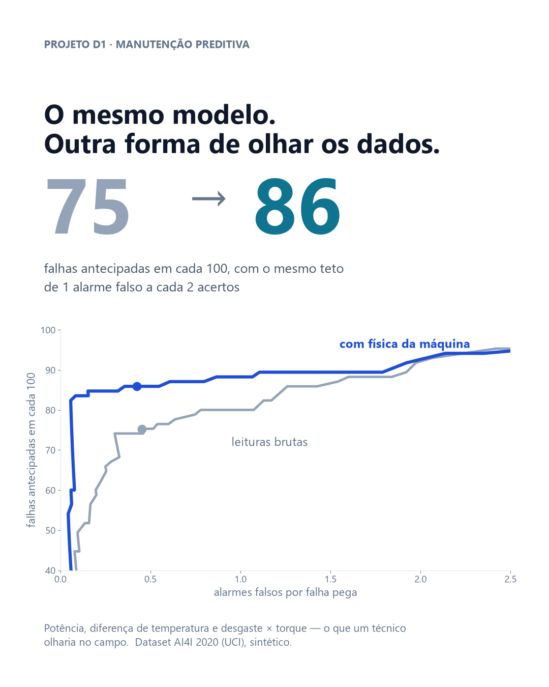

# Conhecimento de manutenção antecipa mais falhas do que um modelo mais sofisticado

**Com o mesmo modelo e o mesmo teto de alarmes falsos, transformar as leituras dos
sensores em grandezas físicas da máquina sobe de 75 para 86 as falhas antecipadas
em cada 100.**



## A pergunta

De cada 100 falhas de uma fresadora, quantas dá para antecipar com os sensores que
a máquina já tem — sem encher a equipe de alarmes falsos?

É a pergunta de quem decide parar ou não uma máquina. Falha não antecipada vira
parada não planejada, peça perdida e hora extra de recuperação. Alarme falso vira
inspeção à toa — e, repetido demais, um alarme que a equipe deixa de atender.

## Os dados

[AI4I 2020 Predictive Maintenance Dataset](https://archive.ics.uci.edu/dataset/601/ai4i+2020+predictive+maintenance+dataset),
UCI Machine Learning Repository, publicado junto ao artigo *Explainable Artificial
Intelligence for Predictive Maintenance Applications* (2020).

10.000 registros, 0,5 MB, nenhum valor faltante. Cada registro é um ponto de
operação de uma fresadora: temperatura do ar e do processo, rotação, torque, minutos
de uso da ferramenta e tipo de produto. 339 registros (3,4%) são falha, divididos em
cinco tipos: desgaste da ferramenta, dissipação de calor, potência fora da faixa,
sobrecarga e aleatória.

## O que eu fiz

Treinei o **mesmo** Random Forest duas vezes, com a mesma configuração e sem busca de
hiperparâmetros — a comparação é entre formas de olhar os dados, não entre ajustes.

- **Leituras brutas:** as cinco medições de sensor e o tipo de produto.
- **Com física da máquina:** as mesmas medições, mais três grandezas que um técnico
  olharia no campo — potência mecânica (torque × rotação), diferença entre a
  temperatura do processo e a do ar, e desgaste × torque.

O limiar do alarme foi escolhido só com dados de treino, por validação cruzada, com
uma regra fixada antes: **no máximo 1 alarme falso a cada 2 falhas pegas**. A
avaliação final usou 2.500 registros que o modelo nunca viu.

| | Leituras brutas | Com física da máquina |
|---|---|---|
| Falhas pegas no teste | 64 de 85 | **73 de 85** |
| Falhas antecipadas em cada 100 | 75 | **86** |
| Alarmes falsos | 29 | 31 |
| Alarmes falsos por falha pega | 0,45 | 0,42 |

A acurácia foi descartada como régua de propósito: um "modelo" que **nunca** prevê
falha acerta 96,6% desse dataset — e não antecipa nenhuma.

## O que isso significa

**Para quem decide:** o ganho veio de conhecimento de manutenção, não de algoritmo.
Antes de investir em modelo mais complexo, vale colocar nos dados o que a equipe de
campo já sabe olhar. É mais barato e mais fácil de explicar para quem vai atender o
alarme.

**Nem todo problema é problema de IA.** Das 12 falhas que escaparam, 10 foram por
desgaste da ferramenta. E todas as 46 falhas desse tipo no dataset aconteceram entre
**198 e 253 minutos** de uso. Janela conhecida não pede previsão: pede **troca
preventiva por tempo de uso**. O modelo cobre o que depende das condições de
operação; a troca programada cobre o que depende do relógio.

**Quando vale ligar o alarme:** todo alarme gera uma inspeção. Com 0,42 alarme falso
por falha pega, o alarme compensa sempre que uma falha custar mais que **1,42
inspeções** — um patamar que quase qualquer parada de linha supera.

## Limitações

- **O dataset é sintético.** Os autores o geraram para imitar uma operação real,
  porque dados reais de manutenção quase nunca podem ser publicados.
- **As falhas foram geradas por regras sobre as mesmas grandezas que derivei.**
  Falha por potência, por dissipação de calor e por sobrecarga seguem limiares de
  potência, diferença de temperatura e desgaste × torque. É por isso que a versão
  "com física" encontra o padrão com tanta facilidade. Numa máquina real o ganho
  existe — é o mesmo raciocínio de um diagnóstico de campo —, mas deve ser **menor**
  do que os 11 pontos medidos aqui.
- **Cada registro é um instante, não uma série.** O modelo não vê a subida gradual
  da temperatura nem o histórico da máquina, que é o que dá antecedência numa
  operação real.
- **Antecedência não medida.** O modelo diz *se* o ponto de operação é de falha, não
  *quanto tempo antes* dá para saber. Esse é o tema do próximo projeto (D2).
- **Falhas aleatórias ficam de fora por definição.** Parte das falhas do dataset foi
  gerada ao acaso, e nenhum modelo as antecipa.
- **Custos não estão em reais.** O ponto de equilíbrio está em "inspeções por falha"
  porque o custo real depende de cada operação.

## Como rodar

```bash
python -m venv .venv
.venv/Scripts/pip install pandas numpy scikit-learn matplotlib jupyter
mkdir dados
curl -L -o dados/ai4i2020.csv https://archive.ics.uci.edu/static/public/601/data.csv
.venv/Scripts/jupyter nbconvert --to notebook --execute --inplace analise.ipynb
```

O notebook [`analise.ipynb`](analise.ipynb) já está salvo com as saídas executadas —
dá para ler sem rodar nada. A semente aleatória é fixa (42), então a execução
reproduz os números acima.

---

Ramon Goveia · [linkedin.com/in/ramon-goveia-92266443](https://www.linkedin.com/in/ramon-goveia-92266443) · projeto D1 de 16 do portfólio
